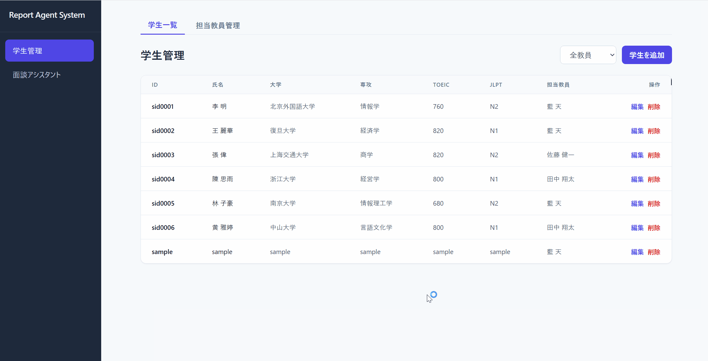
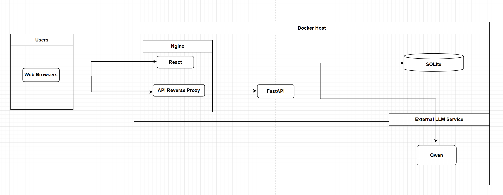

# Smart Repo Agent

A full-stack system for student management and AI-assisted meeting support. Homeroom teachers manage students, teachers, and meeting records, and use an AI agent for natural-language queries and meeting memo summarization.

## Demos

GIFs sit inside **expandable blocks** so the page does not run two loops at once: open **one** demo, watch it, then collapse it before opening the other (GIFs also load only after you expand).

> 👇 **Click the rows below** — each bar is a collapsible screen recording (tap or click to expand).

### Student & teacher management (CRUD)

Forms for creating, editing, and filtering student and teacher records.

<details>
<summary>📋 <strong>Student & teacher</strong> — click to play GIF</summary>
<br>

<p align="center">
  
</p>

</details>

### AI meeting assistant

Natural-language chat: query student data, summarize meeting memos, and update records through agent tools.

<details>
<summary>🤖 <strong>AI agent chat</strong> — click to play GIF</summary>
<br>

<p align="center">
  
</p>

</details>

## Project Structure

```
smart-repo-agent/
├── smart-repo-agent-backend/   # FastAPI backend
├── smart-repo-agent-frontend/  # React frontend (Vite)
├── nginx/                      # Nginx image + config (port 80)
├── docker-compose.yml          # Backend + Nginx (full stack)
└── README.md
```

### Architecture

<p align="center">
  
</p>

<p align="center"><sub>Browser → Nginx → API / agent → SQLite.</sub></p>

## Quick Start (local)

### Backend

```bash
cd smart-repo-agent-backend
python -m venv .venv
.venv\Scripts\activate   # Windows
# source .venv/bin/activate  # Linux/macOS
pip install -r requirements.txt
# Set DASHSCOPE_API_KEY in .env
python main.py
```

API runs at `http://localhost:8000`.

### Frontend

```bash
cd smart-repo-agent-frontend
npm install
npm run dev
```

Runs at `http://localhost:5173` and talks to `http://localhost:8000` by default.

## Docker on AWS EC2

Prerequisites on the instance: Docker Engine and Docker Compose plugin. Clone this repo with submodules initialized so both `smart-repo-agent-backend` and `smart-repo-agent-frontend` are present.

1. Create `smart-repo-agent-backend/.env` with at least:

   ```env
   DASHSCOPE_API_KEY=your_key
   ```

2. From the **repository root**:

   ```bash
   docker compose up -d --build
   ```

3. In the EC2 security group, allow inbound **TCP 80** (or terminate TLS on a load balancer and forward to 80).

4. Open `http://<instance-public-ip>:80` in a browser.

Behavior:

- **Nginx** listens on **80**, serves the built React app, and proxies `/api/` to the FastAPI service.
- **SQLite** lives in a named volume (`backend_data`) at `/app/data/report_agent_system_lantian.db` inside the backend container.
- Swagger UI remains available at `http://<host>/docs`.

To use a different public port, change the left side of the port mapping in `docker-compose.yml` (for example `"8080:80"` to publish container port 80 as host 8080).

## Features

- **Student Management**: CRUD for students with teacher assignment and filtering
- **Teacher Management**: CRUD for homeroom teachers
- **Meeting Records**: Per-student meeting history (create, list, view, delete via API)
- **AI Meeting Assistant**: Chat interface for querying student info, summarizing meeting memos, and updating records via natural language
- **PDF Reports (optional)**: After a meeting is saved with structured fields, the backend can render a PDF (Jinja2 HTML → PDF) and expose `GET /meetings/pdf/{meeting_id}` for download. This requires installing `pdfkit` and system `wkhtmltopdf` locally; the default Docker image does **not** include them. See [Backend README — Optional: PDF Generation](smart-repo-agent-backend/README.md#optional-pdf-generation).

## Tech Stack

| Layer    | Stack                          |
|----------|--------------------------------|
| Backend  | FastAPI, SQLAlchemy, SQLite, Jinja2 (optional PDF templates) |
| Frontend | React 19, Tailwind CSS, Axios  |
| AI       | DashScope (Qwen) via OpenAI API |
| Edge     | Nginx (static + `/api` proxy)  |

## Documentation

- [Backend README](smart-repo-agent-backend/README.md) — API details, agent tools, Docker notes
- [Frontend README](smart-repo-agent-frontend/README.md) — env vars, Docker notes

## License

This project is licensed under the MIT License - see the [LICENSE](LICENSE) file for details.
